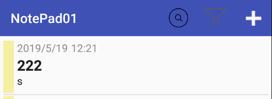
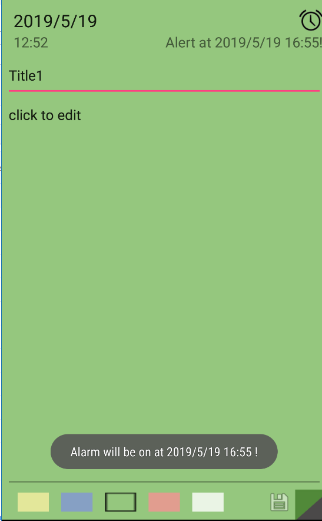

# MyNotePad

## 一、简介

 这是一个安卓开发的简易记事本。

基本功能：添加修改删除Notes，根据关键词搜索相关Notes

扩展功能：修改Note背景，排序功能，为Note增加定时提醒功能。

<a href="./intro_pic/基本功能截图.md">基本功能截图 </a>

<a href="./intro_pic/扩展功能截图.md">扩展功能截图 </a>


## 二、LayOuts


activity_main.xml 使用ToolBar和ListView，ToolBar中定义了search、sort和add按钮

```xml
 <android.support.v7.widget.Toolbar
        android:id="@+id/toolbar"
        android:layout_width="match_parent"
        android:layout_height="?attr/actionBarSize"
        android:background="?attr/colorPrimary"
        android:theme="@style/ThemeOverlay.AppCompat.Dark.ActionBar"
        app:popupTheme="@style/ThemeOverlay.AppCompat.Light" />

    <ListView
        android:layout_width="match_parent"
        android:layout_height="match_parent"
        android:id="@+id/list"
        android:layout_alignParentTop="true"
        android:layout_centerHorizontal="true"
        android:layout_weight="10"
        android:padding="5dp"/>

```
 <br/>

 notes_list.xml  由一个显示该条Note的背景的imageView一个显示闹钟图标的imageView和多个TextView组成。
activity_edit.xml 

```xml
 <LinearLayout
        android:orientation="horizontal"
        android:layout_width="match_parent"
        android:layout_height="wrap_content"
        android:layout_gravity="center_horizontal" >

        <LinearLayout
            android:orientation="horizontal"
            android:layout_width="match_parent"
            android:layout_height="30dp"
            android:layout_gravity="center_horizontal"
            android:layout_weight="1" >

            <TextView
                android:layout_width="wrap_content"
                android:layout_height="fill_parent"
                android:textAppearance="?android:attr/textAppearanceLarge"
                android:text="2017/1/1"
                android:id="@+id/dateText"
                android:layout_marginLeft="10dp" />

            <Space
                android:layout_width="wrap_content"
                android:layout_height="match_parent"
                android:layout_weight="1" />

            <ImageButton
                android:layout_width="30dp"
                android:layout_height="30dp"
                android:id="@+id/alarmButton"
                android:onClick="setAlarm"
                android:background="@drawable/alarm" />
        </LinearLayout>

    </LinearLayout>


    <LinearLayout
        android:orientation="horizontal"
        android:layout_width="match_parent"
        android:layout_height="wrap_content">

        <TextView
            android:layout_width="wrap_content"
            android:layout_height="wrap_content"
            android:textAppearance="?android:attr/textAppearanceMedium"
            android:text="00:00"
            android:id="@+id/timeText"
            android:layout_marginLeft="10dp" />

        <Space
            android:layout_width="wrap_content"
            android:layout_height="match_parent"
            android:layout_weight="1" />

        <TextView
            android:layout_width="wrap_content"
            android:layout_height="wrap_content"
            android:textAppearance="?android:attr/textAppearanceMedium"
            android:text="Alert at ..."
            android:id="@+id/alarmView" />
    </LinearLayout>

    <Space
        android:layout_width="match_parent"
        android:layout_height="8sp" />

    <EditText
        android:layout_width="match_parent"
        android:layout_height="50sp"
        android:id="@+id/titleEdt"
        android:hint="请输入标题..."
        android:gravity="top|left" />

    <EditText
        android:layout_width="match_parent"
        android:layout_height="wrap_content"
        android:id="@+id/editText"
        android:layout_gravity="top|left|center_horizontal"
        android:layout_weight="30"
        android:hint="请输入正文..."
        android:gravity="top|left" />

    <LinearLayout
        android:orientation="horizontal"
        android:layout_width="match_parent"
        android:layout_height="20dp"
        android:layout_gravity="center"
        android:alpha="0.8"
        android:layout_weight="0.93">

        <RadioGroup
            android:layout_width="wrap_content"
            android:layout_height="wrap_content"
            android:orientation="horizontal"
            android:id="@+id/tagRadio"
            android:layout_weight="20"
            android:gravity="center_vertical|center|center_horizontal"
            android:layout_gravity="center"
            >

            <Space
                android:layout_width="wrap_content"
                android:layout_height="match_parent"
                android:layout_weight="2" />

            <RadioButton
                android:layout_width="wrap_content"
                android:layout_height="wrap_content"
                android:id="@+id/yellow"
                android:checked="false"
                android:button="@null"
                android:background="@drawable/radio"
                android:layout_weight="2" />

            <Space
                android:layout_width="wrap_content"
                android:layout_height="match_parent"
                android:layout_weight="2" />

            <RadioButton
                android:layout_width="wrap_content"
                android:layout_height="wrap_content"
                android:id="@+id/blue"
                android:checked="false"
                android:button="@null"
                android:background="@drawable/radio2"
                android:layout_weight="2" />

            <Space
                android:layout_width="wrap_content"
                android:layout_height="match_parent"
                android:layout_weight="2" />

            <RadioButton
                android:layout_width="wrap_content"
                android:layout_height="wrap_content"
                android:id="@+id/green"
                android:checked="false"
                android:button="@null"
                android:background="@drawable/radio3"
                android:layout_weight="2" />

            <Space
                android:layout_width="wrap_content"
                android:layout_height="match_parent"
                android:layout_weight="2" />

            <RadioButton
                android:layout_width="wrap_content"
                android:layout_height="wrap_content"
                android:id="@+id/red"
                android:checked="false"
                android:button="@null"
                android:background="@drawable/radio4"
                android:layout_weight="2" />

            <Space
                android:layout_width="wrap_content"
                android:layout_height="match_parent"
                android:layout_weight="2" />

            <RadioButton
                android:layout_width="wrap_content"
                android:layout_height="wrap_content"
                android:id="@+id/white"
                android:checked="false"
                android:button="@null"
                android:background="@drawable/radio5"
                android:layout_weight="2" />

            <Space
                android:layout_width="wrap_content"
                android:layout_height="match_parent"
                android:layout_weight="2" />

        </RadioGroup>

        <Space
            android:layout_width="40dp"
            android:layout_height="fill_parent" />

        <ImageButton
            android:layout_width="30dp"
            android:layout_height="30dp"
            android:text="SAVE"
            android:id="@+id/saveButton"
            android:onClick="onSave"
            android:maxWidth="10dp"
            android:layout_gravity="center"
            android:background="@drawable/ic_menu_save"
            android:layout_margin="0dp" />

        <Space
            android:layout_width="40dp"
            android:layout_height="fill_parent" />
    </LinearLayout>
```
 <br/>

 Search.xml 由一个SearchView和一个ListView组成以实现动态显示条目 <br/>
  <br/>


## 三、关键代码

MainActivity中OnCreate()方法。

```java
 protected void onCreate(Bundle savedInstanceState) {
        super.onCreate(savedInstanceState);
        setContentView(R.layout.activity_main);


        Toolbar toolbar=(Toolbar) findViewById(R.id.toolbar);
        setSupportActionBar(toolbar);
		
     	//这里使用了LitePal框架
        Connector.getDatabase();
        //addDataLitepPal();
        loadHistoryData();

        adapter=new MemoAdapter(MainActivity.this, R.layout.notes_list, memolist);
        lv=(ListView) findViewById(R.id.list);
        lv.setAdapter(adapter);

        lv.setOnItemClickListener(this);
        lv.setOnItemLongClickListener(this);

    }
```


 loadHistoryData() 使用LitePal框架中的DataSupport.findAll()读取数据到List<Memo> memoes 和 List<OneMemo> memolist中用于mainActivity中所有条目的展示以及Edit中单个条目的展示。

 ```java
  private void loadHistoryData() {
         List<Memo> memoes= DataSupport.findAll(Memo.class);
 
         if(memoes.size()==0) {
             initializeLitePal();
             memoes = DataSupport.findAll(Memo.class);
         }
 
         for(Memo record:memoes) {
             int tag = record.getTag();
             String textDate = record.getTextDate();
             String textTime = record.getTextTime();
             boolean alarm = record.getAlarm().length() > 1 ? true : false;
             String mainText = record.getMainText();
             String title = record.getTitle();
             OneMemo temp = new OneMemo(tag, textDate, textTime, alarm, mainText,title);
             memolist.add(temp);
         }
     }
 ```

 单击和长按条目事件。单击进入编辑条目界面，长按删除条目

 ```java
 @Override
     public void onItemClick(AdapterView<?> parent, View view, int position, long id) {
         Intent it=new Intent(this,Edit.class);
 
         Memo record=getMemoWithNum(position);
 
         //add information into intent
         transportInformationToEdit(it, record);
 
         startActivityForResult(it,position);
     }
 
     @Override
     public boolean onItemLongClick(AdapterView<?> parent, View view, int position, long id) {
 
         int n=memolist.size();
 
         //if this memo has an alarm clock
         //cancel it
         if(memolist.get(position).getAlarm()) {
             cancelAlarm(position);
         }
         memolist.remove(position);
         adapter.notifyDataSetChanged();
 
         String whereArgs = String.valueOf(position); //why not position ?
         DataSupport.deleteAll(Memo.class, "num = ?", whereArgs);
 
         for(int i=position+1; i<n; i++) {
             ContentValues temp = new ContentValues();
             temp.put("num", i-1);
             String where = String.valueOf(i);
             DataSupport.updateAll(Memo.class, temp, "num = ?", where);
         }
 
         return true;
     }
 ```

OneShotAlarm extends BroadcastReceiver 广播接收器，闹钟时间到了Toast弹出提示，notification在下拉窗显示通知，手机振动(须在Mainefest中声明权限)

```java
 public void onReceive(Context context, Intent intent) {
        //showMemo(context);

        alarmId=intent.getIntExtra("alarmId",0);

        Toast.makeText(context,"Time UP!",Toast.LENGTH_LONG).show();

        Vibrator vb =(Vibrator) context.getSystemService(Context.VIBRATOR_SERVICE);
        vb.vibrate(300);

        showNotice(context);
    }

    //show notice and it can be clicked
    private void showNotice(Context context) {
        int num=alarmId-BIG_NUM_FOR_ALARM;
        Log.d("MainActivity","alarmNoticeId "+num);

        //********************BUG SOLVED***********************
        //got a bug here:
        //after clicking the notice, we cannot get to the correct memo
        //while we always go to the second memo initialized
        //****************************************************
        Intent intent=new Intent(context,Edit.class);

        Memo record= getMemoWithId(num);
        deleteTheAlarm(num);//or num

        transportInformationToEdit(intent,record);

        PendingIntent pi=PendingIntent.getActivity(context,0,intent,PendingIntent.FLAG_UPDATE_CURRENT);//PendingIntent.FLAG_UPDATE_CURRENT is very important which caused a bug and troubles me for a long time

        NotificationManager manager=(NotificationManager) context.getSystemService(context.NOTIFICATION_SERVICE);
        Notification notification=new NotificationCompat.Builder(context)
                .setContentTitle(record.getTextDate()+" "+record.getTextTime())
                .setContentText(record.getMainText())
                .setWhen(System.currentTimeMillis())
                .setSmallIcon(R.mipmap.ic_launcher)
                .setLargeIcon(BitmapFactory.decodeResource(context.getResources(),R.drawable.icon))
                .setContentIntent(pi)
                .setAutoCancel(true)
                //.setStyle(new NotificationCompat.BigTextStyle().bigText(record.getMainText()))
                .setLights(Color.GREEN,1000,1000)
                .build();
        manager.notify(num,notification);
    }
```
<br/>
搜索
```
  protected void onCreate(Bundle savedInstanceState) {
        super.onCreate(savedInstanceState);
        setContentView(R.layout.activity_search);
        SearchView searchview = (SearchView)findViewById(R.id.search_view);
        //为查询文本框注册监听器
        searchview.setOnQueryTextListener(SearchActivity.this);
    }
  @Override
    public boolean onQueryTextChange(String s) {

        Cursor c= DataSupport.findBySQL("select * from memo where title like '%"+s+"%'");

        if(c.moveToFirst()){
            do{
                int tag = c.getInt(c.getColumnIndex("tag"));
                Log.d("s", "onQueryTextChange: "+tag);
                String textDate = c.getString(c.getColumnIndex("textdate"));
                Log.d("textDate", "onQueryTextChange: "+textDate);
                String textTime = c.getString(c.getColumnIndex("texttime"));
                Log.d("textTime", "onQueryTextChange: "+textDate);
                boolean alarm = c.getString(c.getColumnIndex("alarm")).length() > 1 ? true : false;
                String mainText = c.getString(c.getColumnIndex("maintext"));
                String title = c.getString(c.getColumnIndex("title"));
                OneMemo temp = new OneMemo(tag, textDate, textTime, alarm, mainText,title);
                memolist.add(temp);
                //Log.d("MainActivity2", "result: " +result );
            }while(c.moveToNext());
        }
           c.close();

        adapter=new MemoAdapter(SearchActivity.this, R.layout.notes_list, memolist);
        setListAdapter(adapter);
        return false;
    }
 ``` 
 <br/>

## End

